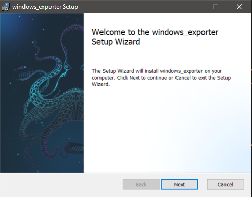
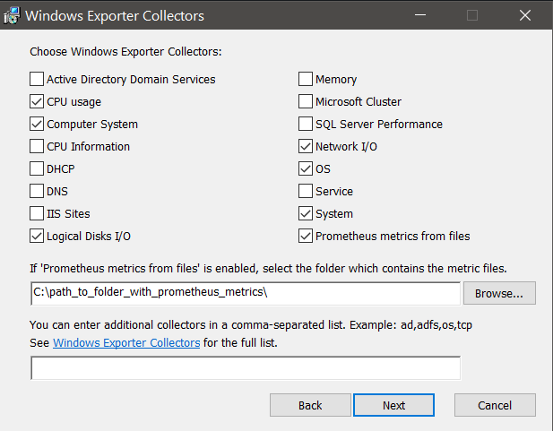

# Sysdig Windows Prometheus Bundle
The Sysdig Windows Prometheus Bundle is a comprehensive package that installs and configures a [Prometheus Agent](https://prometheus.io/blog/2021/11/16/agent/) and the [Windows Exporter](https://github.com/prometheus-community/windows_exporter) allowing you to send metrics to your Sysdig Monitor account with ease. 

<p align="center"> </img> </p>

## Key features: 
* User-friendly visual installation wizard
* Interactive enabling of [a vast variety of collectors](https://github.com/prometheus-community/windows_exporter#collectors)
* Prometheus Agent and Windows Exporter run as Windows services
* Metrics enriched with Windows Domain and Instance host name for easy identification in Sysdig Monitor

<p align="center"> </img></p>

## Getting Started
To begin monitoring your Windows machines, follow these steps: 
1. Download the binary installer from the [latest release](https://github.com/sysdiglabs/Sysdig-Windows-Prometheus-Bundle/releases) of this project
2. Run the installer in your windows machine
3. Configure the [Sysdig region](https://docs.sysdig.com/en/docs/administration/saas-regions-and-ip-ranges/#sysdig-platform-regions) and your Sysdig API token in the wizard
4. Select the collectors that you want to enable to produce metrics
5. Finish the installation
6. Go to your Sysdig Monitor account and start using the [Microsoft Windows dashboards and alerts](https://docs.sysdig.com/en/docs/sysdig-monitor/integrations/integration-library/infrastructure-integrations/windows/)

<p align="center"> </img></p>


## Automated installation
You can automate the installation of the Sysdig Windows Prometheus Bundle across multiple machines using the command line or PowerShell.

Use the following command as an example: 
```
msiexec /i windows_exporter-1.0.0-x64.msi ENABLED_COLLECTORS=cpu,os SYSDIG_URL="https://api.sysdigcloud.com/prometheus/remote/write" SYSDIG_TOKEN="yyyyyyy-zzzz-zzzz-zzzz-xxxxxxxx" /qn
```

This command will install the Sysdig Windows Prometheus Bundle with the specified settings, making it easy to deploy across your infrastructure.

### Options and parameters
From the command line you can use these options: 
* `ENABLED_COLLECTORS`: Comma separated list of [collectors](https://github.com/prometheus-community/windows_exporter#collectors)
* `SYSDIG_URL`: The Prometheus endpoint of your Sysdig Monitor region in the form `https://api.sysdigcloud.com/prometheus/remote/write`. Consult the available regions [here](https://docs.sysdig.com/en/docs/administration/saas-regions-and-ip-ranges/#prometheus-endpoints-and-regions).
* `COMPUTER_NAME` (optional): Overrides the label `instance` in metrics generated by the Windows Exporter with a custom value. The default value is the computer name stored in the `COMPUTERNAME` Windows environment variable.
* `TEXTFILE_DIR` (only if `textfile` collector is enabled): The local folder where the `textfile` collector will look for files
